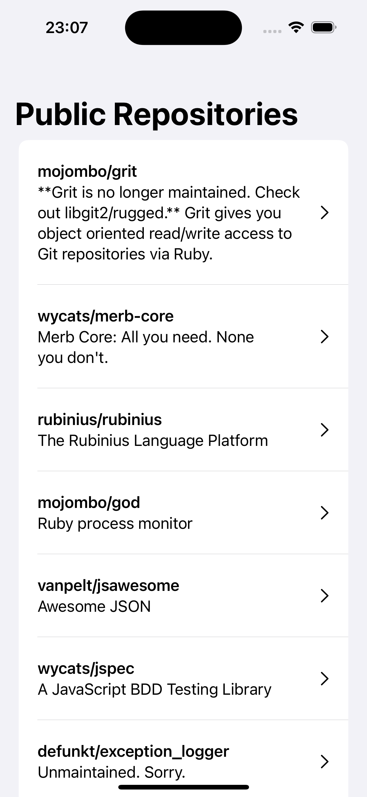
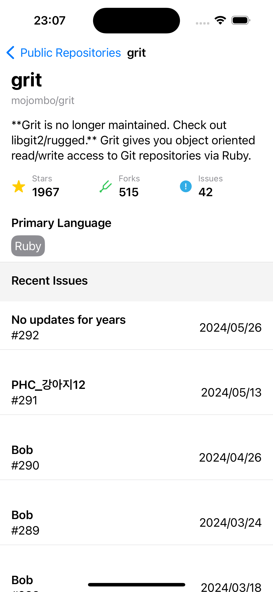

# SwiftUI-MVVM

This is a demo project built with SwiftUI and MVVM architecture, together with the Observation framework.

The primary advantage of using a View Model is its testability. By separating the logic from the view we can easily test state changes.

`@Environment` is used to inject dependencies in views, which allows the injection of different implementations for Previews effortlessly.

The `RouterPath` class is responsible for handling all navigation in NavigationStack, ensuring that navigation is based on the intended destination as specified by `RouterDestination`.

|RepoList|RepoDetail|
|-|-|
|||

## Requirements

Xcode 15.4+

## Before getting started

Replace the value for `Constants.GitHub.accessToken` with your own GitHub access token.
